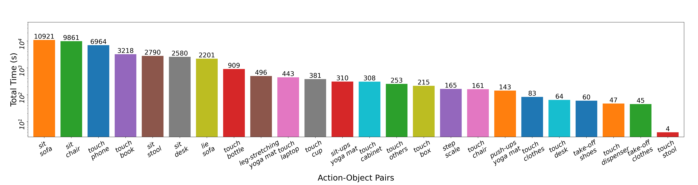

# Thermal-IM Dataset


**What Happened 3 Seconds Ago? Inferring the Past with Thermal Imaging, CVPR 2023** [PDF](files/CVPR2023_Thermal_IM_full.pdf)

[Zitian Tang](https://zitiantang.github.io/), [Wenjie Ye](https://github.com/Anson529), [Wei-Chiu Ma](http://people.csail.mit.edu/weichium/), [Hang Zhao](https://hangzhaomit.github.io/)

<br>

This repository introduces Thermal Indoor Motion dataset (Thermal-IM), which contains synchronized RGB-Thermal and RGB-Depth videos about indoor human motion. This dataset covers various human-object interactions in living room and office room. Many of these human activities can leave thermal imprints on the objects. This dataset also provides annotated human action time and estimated 2D and 3D human poses.

## Download

You can download Thermal-IM dataset from [here](https://drive.google.com/drive/folders/1oH3uHXeQAIfeHAsz2CFRxPKUJmC-x9sx?usp=share_link).

## Dataset Statistics

Thermal-IM includes 783 video clips with \~560k frames in total (\~10.4 hours). Each clip contains 0\~9 annotated human-object interactions. 74% of the videos involve one actor and two different rooms. The rest is a held-out part for generalization test in our work, engaging one another actor or room. In each room, we construct different scenes by changing the viewing angles or rearranging the furniture.

The number of occurrences and total duration for each action-object pair are shown below.




## Dataset Contents

### Overall Information

+ `meta.csv`. It contains the actor, room and scene number in each video clip. The train-validation-test split used in our paper is also provided.
+ **Camera intrinsics**: `intri.npz`. It contains four arrays:
  + `RGBT_K`and `RGBT_distortion`: intrinsics of the RGB-Thermal camera's RGB channel.
  + `RGBD_K`and `RGBD_distortion`: intrinsics of the RGB-Depth camera.

### Video Clips

Each folder in the dataset contains a clip described by the following files:

+ **Videos**:
  + RGB channel of the RGB-Thermal camera: `RGBT_RGB.mp4` (1080 x 1920, 15 FPS)
  + Thermal channel of the RGB-Thermal camera: `RGBT_T.mp4` (288 x 384, 15 FPS)
  + RGB channel of the RGB-Depth camera: `RGBD_RGB.mp4` (480 x 640, 15 FPS)
+ **Depth point cloud** of the RGB-Depth camera: `RGBD_D/*.npy` (480 x 640, 15 FPS)
+ **Action annotation**: `annotation.json`. It is a list of action annotations and each annotation contains the following attributes:
  + `start`: the start time of the action (in seconds).
  + `end`: the end time of the action (in seconds).
  + `action`: the action name
  + `object`: the object involved in the interaction

+ **Camera extrinsics** and **estimated human poses**: `info.npz` . It contains six arrays:
  + `RGBT_R`and `RGBT_T`: extrinsics of the RGB-Thermal camera's RGB channel.
  + `RGBD_R`and `RGBD_T`: extrinsics of the RGB-Depth camera.
  + `pose_3d`: estimated 3D human poses in the coordinate of the RGB-Thermal camera's RGB channel.
  + `pose_2d`: estimated 2D human poses in the image plane of the RGB-Thermal camera's RGB channel.

### Joint Types

Thermal-IM uses [OpenPose](https://github.com/CMU-Perceptual-Computing-Lab/openpose) body_25 as the human pose format. The connections are

```python
connections = [
    (0, 1),  # Nose -> Neck
    (1, 2),  # Neck -> Right shoulder
    (2, 3),  # Right shoulder -> Right Elbow
    (3, 4),  # Right Elbow -> Right wrist
    (1, 5),  # Neck -> Left shoulder
    (5, 6),  # Left shoulder -> Left elbow
    (6, 7),  # Left elbow -> Left wrist
    (1, 8),  # Neck -> Mid hip
    (8, 9),  # Mid hip -> Right hip
    (9, 10), # Right hip -> Right knee
    (10, 11),# Right knee -> Right ankle
    (8, 12), # Mid hip -> Left hip
    (12, 13),# Left hip -> Left knee
    (13, 14),# Left knee -> Left ankle
    (0, 15), # Nose -> Right eye
    (15, 17),# Right eye ->Right ear
    (0, 16), # Nose -> Left eye
    (16, 18),# Left eye -> Left ear
    (11, 22),# Right ankle -> Right big toe
    (22, 23),# Right big toe -> Right small toe
    (11, 24),# Right ankle -> Right heel
    (14, 19),# Left ankle -> Left big toe
    (19, 20),# Left big toe -> Left small toe
    (14, 21) # Left ankle -> Left heel
]
```

## Citation

We will be happy if you find this dataset useful. Please cite our work if you use it.

```
@inproceedings{ThermalIM2023,
      title = {What Happened 3 Seconds Ago? Inferring the Past with Thermal Imaging}, 
      author = {
      	Zitian Tang and
      	Wenjie Ye and
      	Wei-Chiu Ma and
      	Hang Zhao},
      booktitle = {CVPR},
      year = {2023}
}
```


## LICENSE

Thermal-IM Dataset is released under [BSD-3-Clause](LICENSE).

